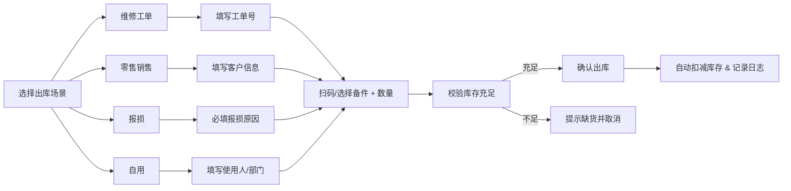
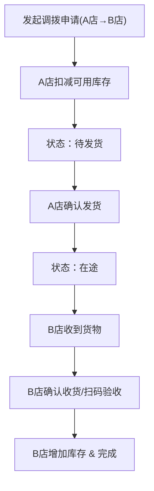

# 维修门店备件库存台账 - 产品需求文档

## 1. 产品概述

面向夫妻店、街边维修铺和小型连锁门店的轻量级备件库存管理系统。系统聚焦备件台账核心功能，摒弃复杂进销存流程，提供务实清晰的操作体验，帮助门店高效管理备件库存、出入库、调拨和预警。

- **目标用户**：手机维修店、家电维修铺、汽车快修店等小型维修门店老板及员工
- **核心价值**：快速登记出入库、实时掌握库存状况、提前预警缺货滞销、多门店灵活调拨

---

## 2. 核心功能

### 2.1 用户角色

| 角色 | 注册方式 | 核心权限 |
|------|----------|----------|
| 店主/管理员 | 默认创建 | 全部功能、查看报表、员工管理 |
| 普通员工 | 店主添加 | 出入库登记、盘点、查看库存 |

### 2.2 功能模块总览

1. **库存首页**：库存总值看板、出入库趋势、低库存预警、常用备件快捷出库
2. **备件档案**：品类管理、适配机型、品质等级、供应商关联、价格体系、存放位置
3. **入库出库**：三种入库来源（采购单/散件补货/旧机拆件）、四种出库场景（维修工单/零售/报损/自用）
4. **门店调拨**：多门店间调拨申请、确认收货、在途查询
5. **盘点修正**：扫码/手动盘点、盈亏记录、原因标注
6. **预警报表**：低库存、久未动销、高返修、毛利异常、热销备件五大类预警

### 2.3 页面详细说明

| 页面名称 | 模块名称 | 功能描述 |
|----------|----------|----------|
| 库存首页 | 数据看板 | 库存总值、今日出入库金额、备件总数、预警数量统计卡片 |
| 库存首页 | 趋势图表 | 近7天出入库数量趋势柱状图 |
| 库存首页 | 快捷操作 | 常用备件一键出库、快速入库入口 |
| 库存首页 | 预警提醒 | 低库存Top10列表，红色高亮缺货 |
| 备件档案 | 备件列表 | 搜索、筛选（品类/供应商/品质）、分页表格展示 |
| 备件档案 | 新增/编辑 | 品类、适配机型、品质等级、供应商、进货价、零售价、保修天数、存放位置、安全库存 |
| 备件档案 | 详情面板 | 批次照片、价格变动历史、出入库记录、库存流水 |
| 备件档案 | 供应商管理 | 供应商联系人、电话、地址、主营品类 |
| 入库出库 | 入库登记 | 三种入库来源切换：采购单（供应商+批次）、散件补货、旧机拆件 |
| 入库出库 | 出库登记 | 四种出库场景：关联维修工单号、零售销售、报损（原因）、自用 |
| 入库出库 | 出入库流水 | 按日期/类型筛选，可撤销最近操作 |
| 门店调拨 | 调拨申请 | 选择目标门店、备件明细、备注说明 |
| 门店调拨 | 确认收货 | 对方发货后扫码/点选确认，自动增减双方库存 |
| 门店调拨 | 在途查询 | 查看待收货、待发货的调拨单状态 |
| 盘点修正 | 盘点任务 | 创建盘点单、按品类/货架筛选盘点范围 |
| 盘点修正 | 数量录入 | 扫码枪输入或手动填写实盘数量 |
| 盘点修正 | 盈亏处理 | 自动计算盈亏数量/金额，必填原因后确认修正 |
| 预警报表 | 低库存预警 | 低于安全库存的备件列表，支持一键补货 |
| 预警报表 | 久未动销 | 超过90天无出入库的备件，建议清库 |
| 预警报表 | 高返修批次 | 返修率超过阈值的批次警示 |
| 预警报表 | 毛利异常 | 零售价低于进货价或毛利率异常的备件 |
| 预警报表 | 热销备件 | 近30天出库量Top20，建议备货 |

---

## 3. 核心业务流程

### 3.1 备件入库流程

### 3.2 备件出库流程

### 3.3 门店调拨流程

---

## 4. 用户界面设计

### 4.1 设计风格

- **整体风格**：务实工业风，清晰高效，拒绝过度装饰
- **主色调**：深蓝灰 `#1e293b` 作为导航栏底色，搭配琥珀橙 `#f59e0b` 作为操作强调色
- **辅助色**：翠绿 `#10b981`（入库/正常）、赤红 `#ef4444`（出库/预警）、湛蓝 `#3b82f6`（调拨）
- **字体**：中文使用 `PingFang SC` / `Microsoft YaHei`，数字使用 `JetBrains Mono` 等宽字体
- **按钮风格**：直角微圆角（2px），实心按钮高对比度，悬停加深色阶
- **布局**：左侧固定导航栏 + 顶部面包屑/操作栏 + 内容区卡片式布局
- **图标风格**：lucide-react 线性图标，统一 18px 尺寸

### 4.2 页面设计要素

| 页面名称 | 模块名称 | UI 设计要点 |
|----------|----------|-------------|
| 库存首页 | 数据看板 | 4张统计卡片，顶部横向排列，每张配渐变色图标和趋势箭头 |
| 库存首页 | 趋势图表 | 左图右表布局，柱状图用双色区分出入库 |
| 库存首页 | 快捷出库 | 圆角方形快捷按钮，带备件缩略图和数量 |
| 备件档案 | 列表表格 | 斑马纹表格行，悬停高亮，操作列固定右侧 |
| 备件档案 | 表单弹窗 | 左右两栏布局，左侧基础信息，右侧高级信息 |
| 入库出库 | Tab切换 | 顶部入库/出库大Tab切换，操作区表单清晰分区 |
| 入库出库 | 流水表格 | 时间倒序排列，颜色标签区分类型 |
| 门店调拨 | 三列状态卡 | 待发货/在途/待收货三栏并列，卡片拖拽视觉效果 |
| 盘点修正 | 盘点录入 | 左侧待盘点列表，右侧输入面板，支持扫码连续输入 |
| 预警报表 | 预警分类Tab | 5个预警分类Tab，每类用不同颜色圆点标识 |

### 4.3 响应式设计

- **桌面优先**：最小支持 1280px 宽度，主内容区最小 960px
- **平板适配**：1024px 时导航栏折叠为图标模式，悬停展开文字
- **触控优化**：所有操作按钮最小 36px 点击区域，表单控件加大内边距

---

## 5. 辅助功能模块

| 功能名称 | 功能说明 |
|----------|----------|
| 供应商联系人 | 供应商姓名、电话、微信、地址、主营品类、合作备注 |
| 批次照片 | 每个入库批次支持上传多张照片（采购单、快递单、备件实拍） |
| 价格变动记录 | 每次调整进货价/零售价自动记录时间、旧值、新值、操作人 |
| 常用备件快捷出库 | 首页置顶高频备件，点击即弹出数量确认框快速出库 |
| 库存总值统计 | 按加权平均成本计算实时库存总值，支持按品类/门店统计 |
| 员工操作日志 | 所有增删改操作记录操作人、时间、IP、变更前后值 |
