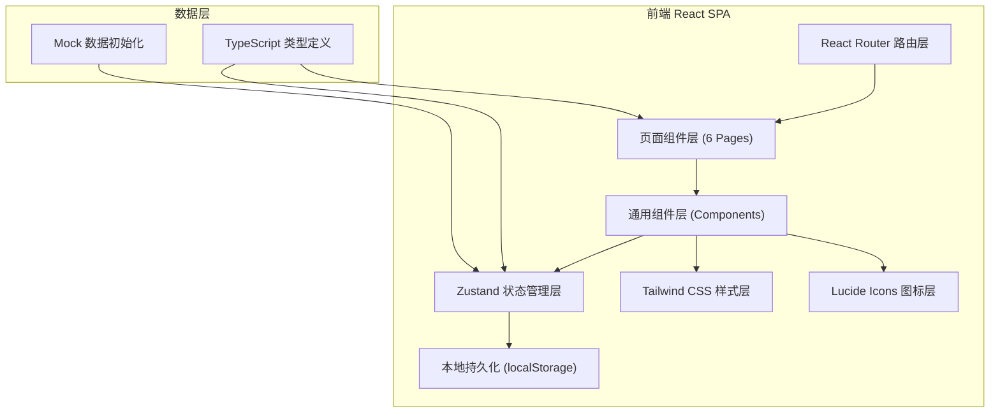
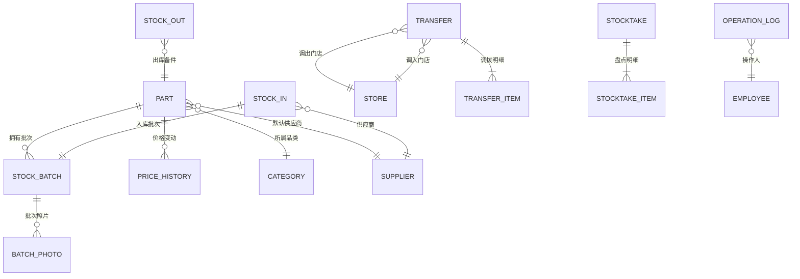

# 维修门店备件库存台账 - 技术架构文档

## 1. 架构设计



本项目为纯前端 SPA 应用，所有数据使用 Zustand 管理并持久化到 localStorage，无需后端服务即可完整演示所有功能。

---

## 2. 技术选型说明

| 技术栈 | 版本 | 用途说明 |
|--------|------|----------|
| React | 18.x | UI 框架，函数式组件 + Hooks |
| TypeScript | 5.x | 类型安全，减少运行时错误 |
| Vite | 5.x | 构建工具，快速开发热更新 |
| Tailwind CSS | 3.x | 原子化 CSS，快速构建一致 UI |
| React Router DOM | 6.x | 前端路由，页面导航 |
| Zustand | 4.x | 轻量级状态管理，替代 Redux |
| Lucide React | 最新 | 统一线性图标库 |
| Recharts | 2.x | 数据可视化图表（趋势图） |

- **初始化工具**：vite-init 脚手架
- **包管理器**：npm（Windows 环境）
- **数据库**：localStorage（持久化 Zustand store）+ 预置 Mock 数据

---

## 3. 路由定义

| 路由路径 | 页面组件 | 功能说明 |
|----------|----------|----------|
| `/` | Dashboard | 库存首页，跳转至 `/dashboard` |
| `/dashboard` | Dashboard | 数据看板、快捷操作、预警提醒 |
| `/inventory` | Inventory | 备件档案列表、新增/编辑/详情 |
| `/inventory/:id` | InventoryDetail | 备件详情、流水、照片、价格历史 |
| `/stock-movement` | StockMovement | 入库出库登记、流水查询 |
| `/transfer` | Transfer | 门店调拨申请、确认收货、在途 |
| `/stocktake` | Stocktake | 盘点任务创建、数量录入、盈亏处理 |
| `/reports` | Reports | 预警报表五大分类 |
| `/suppliers` | Suppliers | 供应商联系人管理 |
| `/logs` | OperationLogs | 员工操作日志查询 |

---

## 4. 数据模型定义

### 4.1 实体关系图（ER Diagram）



### 4.2 核心数据模型（TypeScript 类型）

```typescript
// 备件
interface Part {
  id: string;
  sku: string;           // 备件编码
  name: string;          // 备件名称
  categoryId: string;    // 品类ID
  compatibleModels: string[];  // 适配机型
  qualityLevel: 'original' | 'high' | 'generic' | 'refurbished';  // 品质等级
  supplierId: string;    // 默认供应商ID
  purchasePrice: number; // 进货价（加权平均）
  retailPrice: number;   // 零售价
  warrantyDays: number;  // 保修天数
  location: string;      // 存放位置（货架号）
  safetyStock: number;   // 安全库存
  stockQty: number;      // 当前库存
  lastMoveDate: string;  // 最后出入库日期
  repairCount: number;   // 返修次数
  createdAt: string;
  updatedAt: string;
}

// 品类
interface Category {
  id: string;
  name: string;
  parentId?: string;
}

// 供应商
interface Supplier {
  id: string;
  name: string;
  contact: string;       // 联系人
  phone: string;
  wechat?: string;
  address: string;
  mainCategories: string[];
  remark?: string;
}

// 库存批次
interface StockBatch {
  id: string;
  partId: string;
  batchNo: string;
  supplierId?: string;
  purchasePrice: number;
  qty: number;           // 批次剩余数量
  source: 'purchase' | 'scatter' | 'salvage';  // 来源
  repairRate: number;    // 返修率
  inboundDate: string;
}

// 入库记录
interface StockIn {
  id: string;
  no: string;            // 入库单号
  source: 'purchase' | 'scatter' | 'salvage';
  supplierId?: string;
  purchaseOrderNo?: string;
  salvageDeviceNo?: string;
  items: StockInItem[];
  totalAmount: number;
  operatorId: string;
  remark?: string;
  createdAt: string;
}

interface StockInItem {
  partId: string;
  batchNo: string;
  qty: number;
  purchasePrice: number;
}

// 出库记录
interface StockOut {
  id: string;
  no: string;            // 出库单号
  type: 'repair' | 'retail' | 'damage' | 'selfuse';
  repairOrderNo?: string;
  customerName?: string;
  damageReason?: string;
  user?: string;
  items: StockOutItem[];
  totalAmount: number;
  operatorId: string;
  remark?: string;
  createdAt: string;
}

interface StockOutItem {
  partId: string;
  qty: number;
  unitPrice: number;     // 出库单价
}

// 门店调拨
interface TransferOrder {
  id: string;
  no: string;
  fromStoreId: string;
  toStoreId: string;
  status: 'pending_ship' | 'in_transit' | 'pending_receive' | 'completed' | 'cancelled';
  items: TransferItem[];
  applicantId: string;
  shippedAt?: string;
  receivedAt?: string;
  remark?: string;
  createdAt: string;
}

interface TransferItem {
  partId: string;
  qty: number;
}

// 门店
interface Store {
  id: string;
  name: string;
  address: string;
  phone: string;
}

// 盘点单
interface StocktakeOrder {
  id: string;
  no: string;
  status: 'draft' | 'processing' | 'completed';
  items: StocktakeItem[];
  operatorId: string;
  createdAt: string;
  completedAt?: string;
}

interface StocktakeItem {
  partId: string;
  systemQty: number;     // 系统数量
  actualQty: number;     // 实盘数量
  diffQty: number;       // 盈亏数量
  diffAmount: number;    // 盈亏金额
  reason?: string;       // 原因
}

// 价格变动历史
interface PriceHistory {
  id: string;
  partId: string;
  field: 'purchasePrice' | 'retailPrice';
  oldValue: number;
  newValue: number;
  operatorId: string;
  createdAt: string;
}

// 批次照片
interface BatchPhoto {
  id: string;
  batchId: string;
  url: string;           // 照片URL（使用占位图）
  type: 'invoice' | 'package' | 'part';
  remark?: string;
}

// 操作日志
interface OperationLog {
  id: string;
  operatorId: string;
  module: string;        // 模块
  action: 'create' | 'update' | 'delete' | 'confirm';
  targetId: string;
  targetType: string;
  diff?: Record<string, { old: any; new: any }>;
  ip?: string;
  createdAt: string;
}

// 员工
interface Employee {
  id: string;
  name: string;
  username: string;
  role: 'admin' | 'staff';
  phone?: string;
}
```

---

## 5. 目录结构设计

```
src/
├── components/              # 通用组件
│   ├── layout/
│   │   ├── Sidebar.tsx      # 侧边导航
│   │   ├── Header.tsx       # 顶部栏
│   │   └── PageContainer.tsx # 页面容器
│   ├── common/
│   │   ├── StatCard.tsx     # 统计卡片
│   │   ├── DataTable.tsx    # 通用表格
│   │   ├── Modal.tsx        # 通用弹窗
│   │   ├── StatusBadge.tsx  # 状态标签
│   │   ├── Empty.tsx        # 空状态
│   │   └── PartSelector.tsx # 备件选择器
│   └── forms/
│       ├── PartForm.tsx     # 备件表单
│       ├── StockInForm.tsx  # 入库表单
│       └── StockOutForm.tsx # 出库表单
├── pages/                   # 页面
│   ├── Dashboard.tsx
│   ├── Inventory.tsx
│   ├── InventoryDetail.tsx
│   ├── StockMovement.tsx
│   ├── Transfer.tsx
│   ├── Stocktake.tsx
│   ├── Reports.tsx
│   ├── Suppliers.tsx
│   └── OperationLogs.tsx
├── store/                   # Zustand 状态管理
│   ├── index.ts             # 根 store
│   ├── parts.ts             # 备件模块
│   ├── stock.ts             # 出入库模块
│   ├── transfer.ts          # 调拨模块
│   └── mockData.ts          # 预置 Mock 数据
├── types/                   # TypeScript 类型定义
│   └── index.ts
├── utils/                   # 工具函数
│   ├── format.ts            # 格式化（金额、日期、编号）
│   ├── id.ts                # ID 生成器
│   └── calculator.ts        # 库存计算逻辑
├── hooks/                   # 自定义 Hooks
│   └── useToast.ts          # 消息提示
├── App.tsx                  # 根组件
├── main.tsx                 # 入口
├── router.tsx               # 路由配置
└── index.css                # 全局样式 + Tailwind
```

---

## 6. 核心业务规则实现

| 规则 | 实现方式 |
|------|----------|
| 出库库存校验 | 出库时原子化检查 stockQty ≥ 出库数量，不足则阻断 |
| 加权平均成本 | 每次入库后重新计算 part.purchasePrice = (旧库存总值 + 新入库总值) / 新库存总量 |
| 库存总值计算 | SUM(part.stockQty × part.purchasePrice)，支持按品类过滤 |
| 低库存预警 | part.stockQty ≤ part.safetyStock 触发，报表页实时计算 |
| 久未动销判断 | 当前日期 - part.lastMoveDate > 90 天触发 |
| 高返修批次 | StockBatch.repairRate / StockBatch.inboundQty > 5% 触发 |
| 毛利异常 | (part.retailPrice - part.purchasePrice) / part.retailPrice < 10% 或为负数 |
| 调拨状态流转 | 申请→待发货→在途→待收货→完成，每步操作库存 |
| 操作日志记录 | Zustand store 中每个变更方法内部统一调用 writeLog() |
